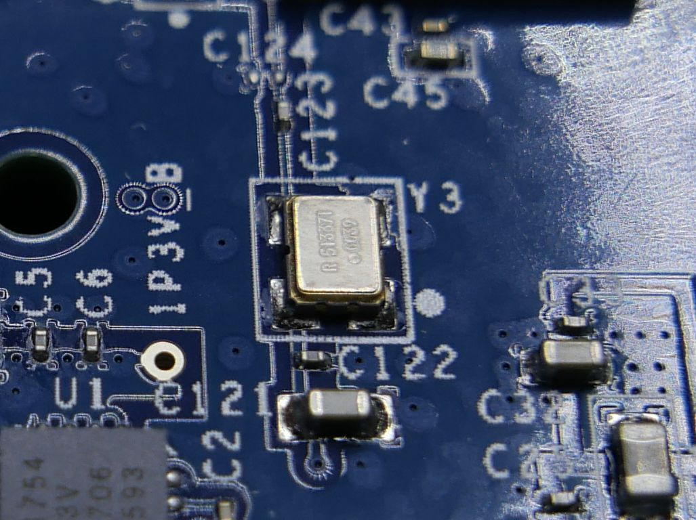
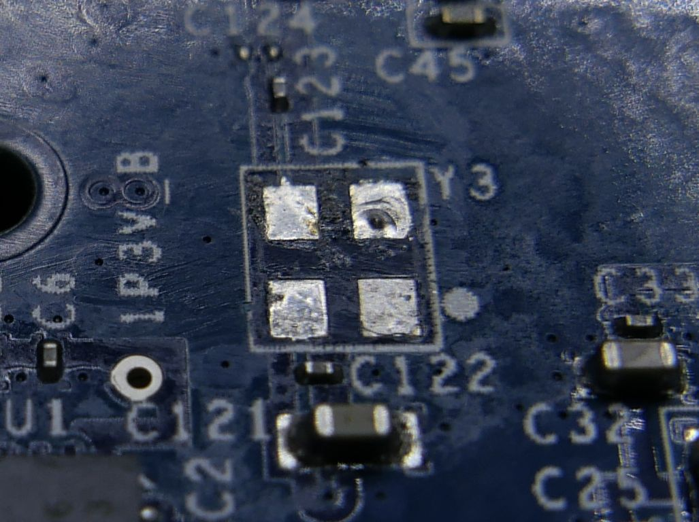
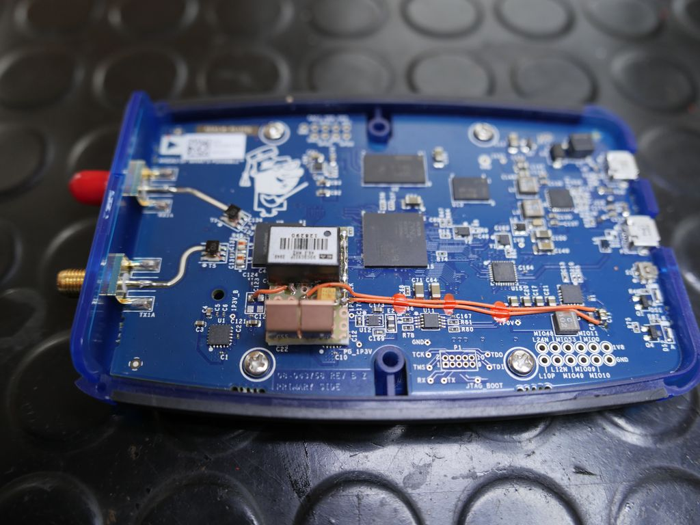
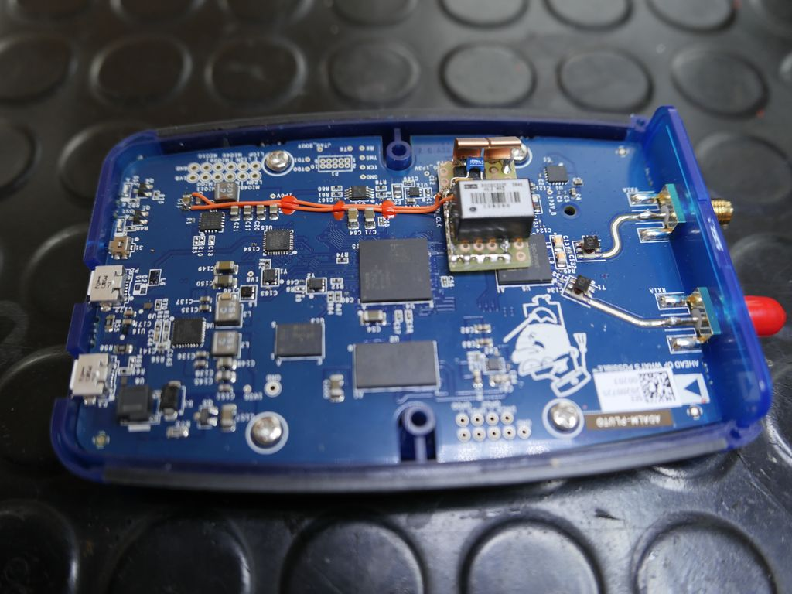
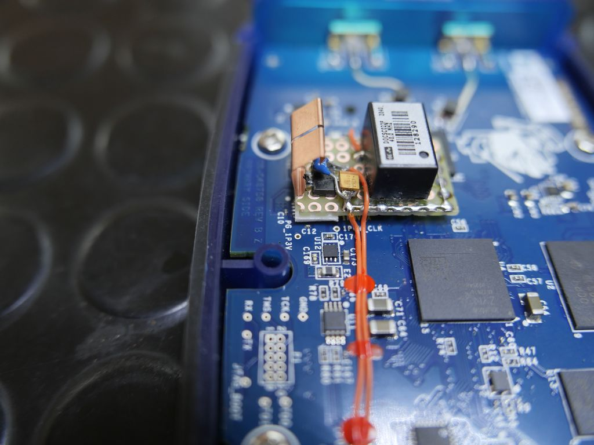

# ADLAM-Pluto OCXO Modification

## About OCXO

A crystal oven is a temperature-controlled chamber used to maintain the quartz crystal in electronic crystal oscillators at a constant temperature,
in order to prevent changes in the frequency due to variations in ambient temperature.
An oscillator of this type is known as an oven-controlled crystal oscillator (OCXO, where "XO" is an old abbreviation for "crystal oscillator".)
The oven-controlled oscillator achieves the best frequency stability possible from a crystal. The short term frequency stability of OCXOs is typically
1×10^−12 over a few seconds, while the long term stability is limited to around 1×10^−8 (10 ppb) per year by aging of the crystal.

See [Wikipedia](https://en.wikipedia.org/wiki/Crystal_oven) for details.

## Details

This modification exchanges the original ADLAM-Pluto crystal oscillator by an temperature-controlled crystal oscillator.

The original oscillator (RXO3225M) is rated with a temperature stability of +-25 ppm.

The replacement temperature-controlled oscillator is rated with +-20 ppb or 0.02 ppm (1 ppb = 1x10^-9).
A Connor-Winfield DOCSC series OCXO is used, type DOCSC022F-040.0M, available from
[Digikey](https://www.digikey.de/product-detail/de/connor-winfield/DOCSC022F-040-0M/CW884CT-ND/5399028) order number CW884CT-ND.

In addition a 3.3V linear regulator and two capacitors are required. In fact the ADLAM-Pluto doesn't provide 3.3V for the OCXO anywhere on its PCB.
So we have to convert down from 5V USB supply. The linear voltage regulator is a LT1117-3.3 in this modification. But any other will do as long as
it can handle the power/current requirements.

__The OCXO requires up to 3W power supply, hence up to 1A @ 3.3V__

My measurements on two units showing 680mA drawn from 5V on power up for few seconds when the OCXO initally heats up. Current then drops down to
~170mA depending on enviroment and Pluto internal temperature. The current drawn decreases with raising temperature and vice versa.

## Preparation

Original crystal oscillator Y3.

The original crystal oscillator Y3 on Pluto PCB must be removed. Warranty will be lost!

## Modification

Example modification. The LT1117-3.3 requires a small heat sink.

## Schematic

See [pluto_ocxo_mod_schematic.pdf](pluto_ocxo_mod_schematic.pdf) for details.

## Calibration

Each ADLAM-Pluto unit is factory calibrated for the installed crystal oscillator. However, this calibration is usually way off for the new OCXO and
has to reverted.

Calibration is done by setting the `xo_correction` environment variable in Pluto bootloader. See last command on this page
[https://wiki.analog.com/university/tools/pluto/devs/booting#examples](https://wiki.analog.com/university/tools/pluto/devs/booting#examples)

Step by step:

1. Connect to Pluto by ssh: `ssh -l root 192.168.2.1` use password `analog`
2. Set enviroment variable: `fw_setenv xo_correction 40000000`
3. `reboot` or cycle Pluto power. 

All environment variables can be printed with `fw_printenv`.

In case you have a precise measurement tool, for example a spectrum analyzer, then you can calibrate your Pluto at the desired operating
frequency and fine tune the value for xo_correction. In that case, wait at least 30min, keep the Pluto powered on during that time, to heat up
and temperature stabilize the entire unit.

__Note__

Keep in mind that any OCXO minimal offset increases with Pluto TX frequency due to internal multiplication.
For example, changing the calibration value `xo_correction` by 1Hz will change the offset by 25Hz @ 1GHz TX frequency. (1GHz / 40MHz = factor 25)
